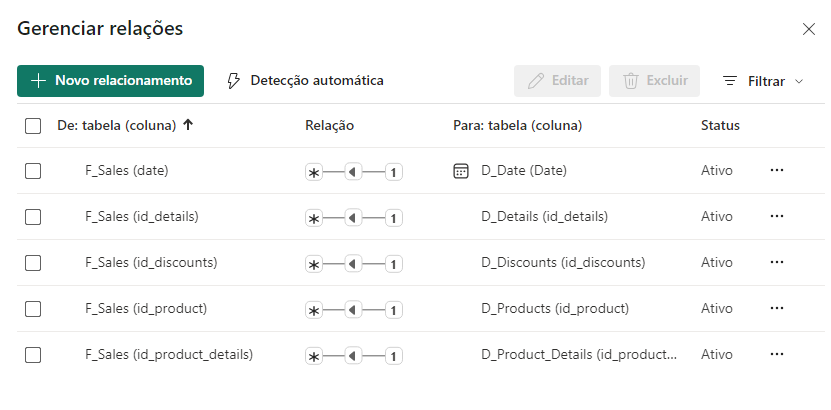
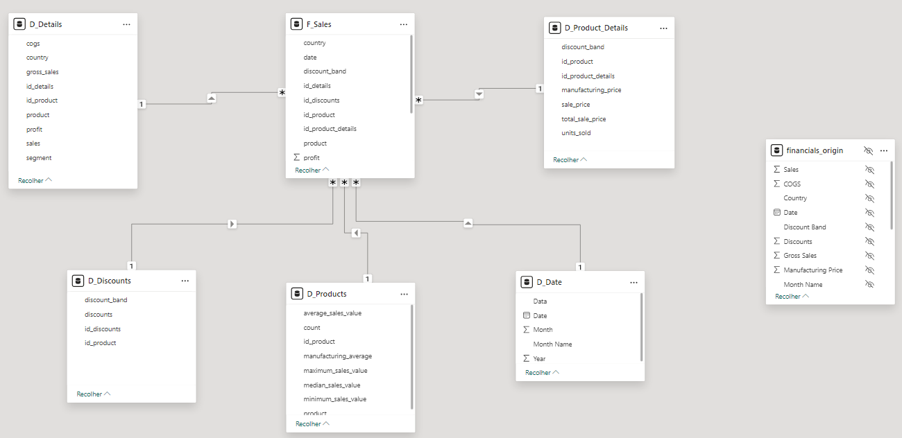

# Modelando um Dashboard de E-commerce com Power BI Utilizando Fórmulas DAX
Resolução do desafio 'Modelando um Dashboard de E-commerce com Power BI Utilizando Fórmulas DAX', do bootcamp oferecido pela NTTData, através da Digital Innovation One (DIO), no módulo 'Modelagem de Dados com Power BI'.

O documento com as instruções para o desenvolvimento do desafio encontra-se disponível no seguinte [endereço eletrônico](https://academiapme-my.sharepoint.com/:w:/g/personal/renato_dio_me/EW76WjPAA8RGgC3i44ofFq4BBiWzM-CN5S312YwOQCIwBA?e=7A6KfG) e a base de dados 'financials' encontra-se disponível [aqui](financial_sample.xlsx).

Esta é uma versão adaptada da resolução proposta por Otto Jacometo, disponível [aqui](https://github.com/Otto-21/DIO/tree/main/desafios/powerBI/desafio%20star%20schema).

# Etapas
## Transformação de dados utilizando o Power Query
1 - Importe os dados do arquivo 'financial_sample.xlsx'.

2 - Abra o Editor do Power Query (Transformar Dados).

3 - Se necessário, altere o tipo de dado de algumas colunas de decimais para decimais fixos.

4 - Crie cinco duplicatas da tabela 'financials' ('D_Produtos', 'D_Descontos', 'D_Detalhes', 'D_Produtos_Detalhes', 'F_Vendas'), renomeando-a para 'financials_origem'.

5 - Na tabela 'D_Produtos', utilize a função de agrupamento avançado para criar as seguintes colunas:
- Contagem: contagem do total de registros agrupados por 'Product'
- Valor máximo de venda: valor máximo de 'Sales' agrupado por 'Product'
- Valor mínimo de venda: valor mínimo de 'Sales' agrupado por 'Product'
- Média do valor de vendas: média do valor de vendas de 'Sales' agrupada por 'Product'
- Mediana do valor de vendas: mediana do valor de 'Sales' agrupada por 'Product'
- Média da manufatura: média de 'Manufacturing Price' agrupada por 'Product'

Após o processo de agrupamento, insira uma coluna de índice iniciando em 0, renomeie-a para 'id_produto' e ordene as colunas conforme achar necessário.

6 - Na tabela 'D_Descontos' mantenha apenas as colunas 'Product', 'Discount Band' e 'Discounts'. Após, adicione uma coluna condicional chamada 'id_produto', substituindo os valores de 'Product' pelos ids gerados na tabela 'D_Produtos' (Ex.: Se 'Product' == 'Montana', então ID = 1). Posteriormente apague a coluna 'Product' e adicione uma coluna de índice chamada de 'id_descontos' iniciando em 0.

7 - Na tabela 'D_Produtos_Detalhes' mantenha apenas as colunas 'Product', 'Units Solds', 'Manufacturing Price', 'Sale Price' e 'Discount Band'. Adicione uma coluna índice 'id_produto_detalhes' iniciando em 0. Após, adicione uma coluna condicional chamada 'id_produto', substituindo os valores de 'Product' pelos ids gerados na tabela 'D_Produtos' (Ex.: Se 'Product' == 'Montana', então ID = 1). Posteriormente apague a coluna 'Product'. Você pode adicionar também uma coluna customizada que calcula o valor total de vendas utilizando a seguinte função DAX:
  
```
= [Sale Price] * [Units Sold]
```

8 - Na tabela 'D_Detalhes', mantenha as colunas 'Segment', 'Country', 'Product', 'Gross Sales', 'Sales', 'COGS' e 'Profit'. Após, adicione uma coluna de índice chamada de 'id_detalhes' iniciando em 0.

9 - Na tabela fato 'F_Vendas', remova as colunas 'COGS', 'Month Number', 'Manufacturing Price' e 'Gross Sales'. Após, adicione uma coluna de índice chamada de 'sk_id' iniciando em 0 (Surrogate Key).

Para adicionar colunas de índice (id_produtos, id_descontos, id_detalhes, id_produto_detalhes) utilize a ferramenta de Mesclar Consultas selecionando a coluna 'id_produto' da 'F_Vendas' e da tabela em que será realizada a mescla (Ex.: selecione a coluna 'id_produto' de 'F_Vendas' e 'id_produto' de 'D_Descontos').

10 - Feche e aplique as alterações.

11 - Em 'Exibição de Modelo' insira uma nova tabela 'D_Data' com o seguinte código DAX:

```
D_Data = 
    ADDCOLUMNS(
        CALENDAR(DATE(2013, 1, 1), DATE(2014, 12, 31)),
        "Year", YEAR([Date]),
        "Month", MONTH([Date]),
        "Month Name", FORMAT([Date], "MMMM"), "Data", FORMAT([Date], "dd/mm/yyyy")
    )
```
> As datas estão entre 2013 e 2014, pois os dados da tabela base estão neste intervalo temporal.

## Criação dos relacionamentos entre as tabelas utilizando a ferramenta de Exibição de Modelo
1 - Em 'Exibição de Modelo', remova os relacionamentos criados automaticamente pelo Power BI clicando com o botão direito em cima do relacionamento e posteriormente em excluir.

2 - Simplesmente arraste a coluna de id correspondente à tabela em que será realizada o relacionamento (Ex.: arraste 'id_desconto' da tabela 'D_Descontos' até 'id_desconto' da tabela 'F_Vendas').



3 - Conforme o anunciado da atividade, oculte a tabela 'financials_origem'.

4 - Após realizar o relacionamento de todas as tabelas, será gerado um modelo semelhante ao seguinte:

